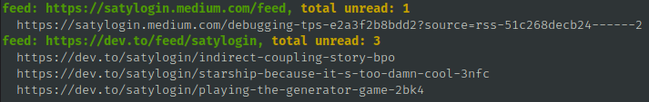

# rss-update

fetches feeds updated based on last run. This is still a work in progress and things are likely to
change.

### Prerequisites
1. rust
2. git
3. cargo

### Installation
1. clone the github package.
2. cd in package dir
3. `cargo run -- setup`
4. `cargo run -- --help`
```bash
rss-update 0.1
To track and fetch updates on rss feeds.

USAGE:
    rss-update [SUBCOMMAND]

FLAGS:
    -h, --help       Prints help information
    -V, --version    Prints version information

SUBCOMMANDS:
    add         Add new feed source to track.
    help        Prints this message or the help of the given subcommand(s)
    read        to mark post as read.
    remove      to remove feed from tracking
    setup       Set up config for traking feeds.
    tracking    Lists feeds that are currently being tracked along with its metadata.
    unread      Display contents of read list on terminal.
```

### Usage
`cargo run -- help` should return output as shown above. you can get spefic command help by running
help on subcommand like 

`cargo run -- add --help`.
```bash
rss-update-add 
Add new feed source to track.

USAGE:
    rss-update add [OPTIONS] --feed <FEED>

FLAGS:
    -h, --help       Prints help information
    -V, --version    Prints version information

OPTIONS:
        --feed <FEED>    rss feed to track
        --from <DATE>    date to start tracking in YYYY-MM-DD (remember to pad with 0)
```

### Output Format


